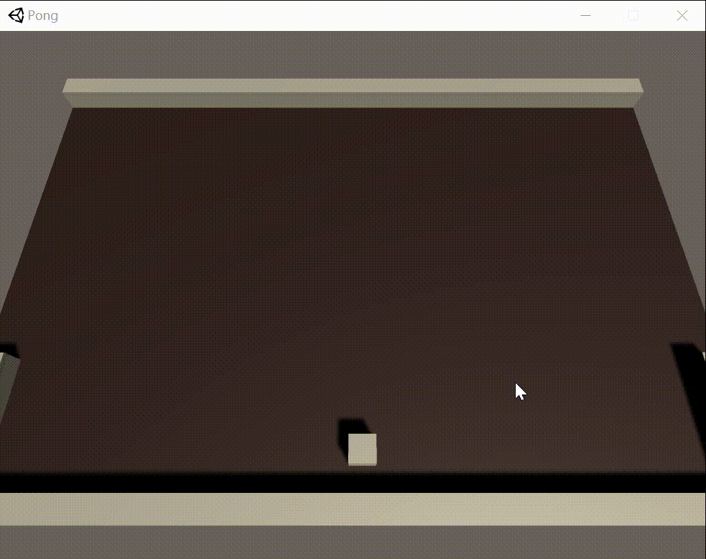

# Pong
Reinforcement Learning with [Unity ML-Agents Toolkit](https://github.com/Unity-Technologies/ml-agents)

use PPO and self-play

Download: [Executable file](https://github.com/Nagisa3113/Pong/releases)




## Train 

```
mlagents-learn config/pong.yaml --run-id=pong
```


- config file: config/pong.yaml
- result file: results/pong
